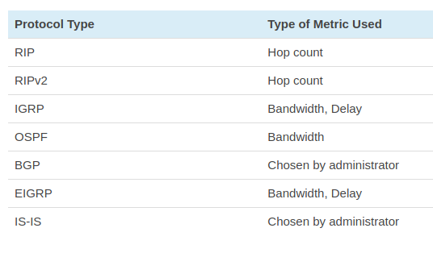

All routing protocols can be classified into the following:

    Distance Vector or Link State Protocols
    Interior Gateway Protocols (IGP) or Exterior Gateway Protocols (EGP)
    Classful or Classless Protocols

### Distance Vector and Link State Protocols

Distance Vector: Sends entire routing table during updates, Sends periodic updates every 30-90 seconds, Broadcasts updates, Vulnerable to routing loops, RIP, IGRP

Link State: Only provides link state information, Uses triggered updates, 	Multi casts updates, No risk of routing loops, OSPF, IS-IS
	

### Distance vector routing protocols 
are protocols that use distance to work out the best routing path for packets within a network. These protocols measure the distance based on how many hops data has to pass to get to its destination. The number of hops is essentially the number of routers it takes to reach the destination.

Generally, distance vector protocols send a routing table full of information to neighboring devices. This approach makes them low investment for administrators as they can be deployed without much need to be managed. The only issue is that they require more bandwidth to send on the routing tables and can run into routing loops as well.
Link State Routing Protocols

### Link state protocols 
take a different approach to finding the best routing path in that they share information with other routers in proximity. The route is calculated based on the speed of the path to the destination and the cost of resources. Link state routing protocols use an algorithm to work this out. One of the key differences to a distance vector protocol is that link state protocols don’t send out routing tables; instead, routers notify each other when route changes are detected.

Routers using the link state protocol creates three types of tables; neighbor table, topology table, and routing table. The neighbor table stores details of neighboring routers using the link state routing protocol, the topology table stores the whole network topology, and the routing table stores the most efficient routes.

### IGP and EGPs

Routing protocols can also be categorized as Interior Gateway Protocols (IGPs) or Exterior Gateway Protocols (EGPs). IGPs are routing protocols that exchange routing information with other routers within a single <b>autonomous system (AS)</b>.

An AS is defined as one network or a collection of networks under the control of one enterprise. The company AS is thus separate from the ISP AS.

Each of the following is classified as an IGP:

    Open Shortest Path First (OSPF)
    Routing Information Protocol (RIP)
    Intermediate System to Intermediate System (IS-IS)
    Enhanced Interior Gateway Routing Protocol (EIGRP)

On the other hand, EGPs are routing protocols that are used to transfer routing information between routers in different autonomous systems. These protocols are more complex and BGP is the only EGP protocol that you’re likely to encounter. However, it is important to note that there is an EGP protocol named EGP.

Examples of EGPs include:

    Border Gateway Protocol (BGP)
    Exterior Gateway Protocol (EGP)
    The ISO’s InterDomain Routing Protocol (IDRP)

## RIP (Routing information protocol)

The original version or RIPv1 determines network paths based on the IP destination and the hop count of the journey.

RIPv1 interacts with the network by broadcasting its IP table to all routers connected to the network. RIPv2 is a little more sophisticated than this and sends its routing table on to a multicast address. RIPv2 also uses authentication to keep data more secure and chooses a subnet mask and gateway for future traffic. The main limitation of RIP is that it has a maximum hop count of 15 which makes it unsuitable for larger networks.

## IGRP (Interor Gateway Routing protocol)

Interior Gateway Protocol or IGRP is a distance vector routing protocol produced by Cisco. IGRP was designed to build on the foundations laid down on RIP to function more effectively within larger connected networks and removed the 15 hop cap that was placed on RIP. IGRP uses metrics such as bandwidth, delay, reliability, and load to compare the viability of routes within the network. However, only bandwidth and delay are used under IGRP’s default settings.

IGRP is ideal for larger networks because it broadcasts updates every 90 seconds and has a maximum hop count of 255. This allows it to sustain larger networks than a protocol like RIP. IGRP is also widely used because it is resistant to routing loops because it updates itself automatically when route changes occur within the network.

## OSPF (Open Shortest path first)

Open Shortest Path First or OSPF protocol is a link-state IGP that was tailor-made for IP networks using the Shortest Path First (SPF) algorithm. The SPF routing algorithm is used to calculate the shortest path spanning-tree to ensure efficient data transmission of packets. OSPF routers maintain databases detailing information about the surrounding topology of the network. This database is filled with data taken from Link State Advertisements (LSAs) sent by other routers. LSAs are packets that detail information about how many resources a given path would take.

OSPF also uses the Dijkstra algorithm to recalculate network paths when the topology changes. This protocol is also relatively secure as it can authenticate protocol changes to keep data secure. It is used by many organizations because it’s scalable to large environments. Topology changes are tracked and OSPF can recalculate compromised packet routes if a previously-used route has been blocked

## Exterior Gateway Protocol (EGP)

Exterior Gateway Protocol or EGP is a protocol that is used to exchange data between gateway hosts that neighbor each other within autonomous systems. In other words, EGP provides a forum for routers to share information across different domains. The most high profile example of an EGP is the internet itself. 

## Enhanced Interior Gateway Routing Protocol (EIGRP)

Enhanced Interior Gateway Routing Protocol or EIGRP is a distance vector routing protocol that is used for IP, AppleTalk, and NetWare networks. EIGRP is a Cisco proprietary protocol that was designed to follow on from the original IGRP protocol. When using EIGRP, a router takes information from its neighbors’ routing tables and records them. Neighbors are queried for a route and when a change occurs the router notifies its neighbors about the change.

## Border Gateway Protocol (BGP)

Border Gateway Protocol or BGP is the routing protocol of the internet that is classified as a distance path vector protocol. BGP was designed to replace EGP with a decentralized approach to routing. The BGP Best Path Selection Algorithm is used to select the best routes for data packet transfers. If you don’t have any custom settings then BGP will select routes with the shortest path to the destination.

## Intermediate System-to-Intermediate System (IS-IS)

Intermediate System-to-Intermediate System (IS-IS) is a link-state, IP routing protocol and IGPP protocol used on the internet to send IP routing information. IS-IS uses a modified version of the Dijkstra algorithm. An IS-IS network consists of a range of components including end systems, (user devices), intermediate systems (routers), areas, and domains.

## Classful Routing Protocols

Classful routing protocols don’t send subnet mask information during routing updates but classless routing protocols do. RIPv1 and IGRP are considered to be classful protocols. These two are classful protocols because they don’t include subnet mask information in their routing updates. Classful routing protocols have since become outdated by classless routing protocols.

## Classless Routing Protocols

As mentioned above, classful routing protocols have been replaced by classless routing protocols. Classless routing protocols send IP subnet mask information during routing updates. RIPv2, EIGRP, OSPF, and IS-IS are all types of class routing protocols that include subnet mask information within updates.

## Dynamic Routing Protocols

Dynamic routing protocols are another type of routing protocols that are critical to modern enterprise-grade networks. Dynamic routing protocols allow routers to automatically add information to their routing tables from connected routers. 

## Routing metrics

    Hop count – Measures the number of routers that a packet must travel through
    Bandwidth – Chooses the routing path based on which has the highest bandwidth
    Delay – Chooses the routing path based on which takes the least time
    Reliability – Assesses the likelihood that a network link will fail based on error counts and previous failures
    Cost – A value configured by the administrator or the IOS which is used to measure the cost of a route based on one metric or a range of metrics
    Load – Chooses the routing path based on the traffic utilization of connected links

## Administrative Distance

Administrative distance is one of the most important features within routers. Administrative is the term used to describe a numerical value that is used to prioritize which route should be used when there are two or more available connection routes. When one or more routes are located, the routing protocol with the lower administrative distance is selected as the route.

